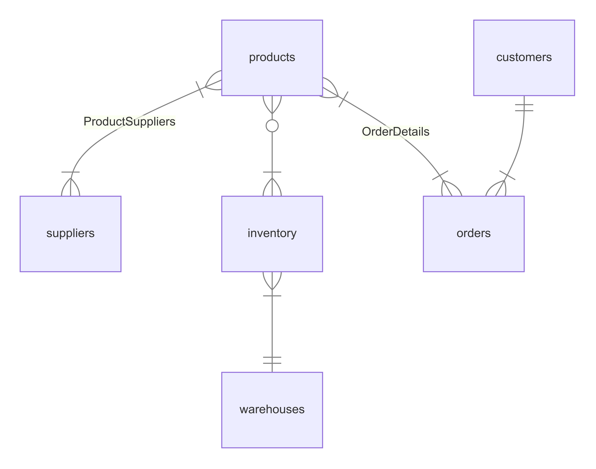

# Design Document 

By Sage Park and Alok Kumar 

Video overview: <URL HERE>

## Scope

The primary purpose of this database is to track and manage inventory levels, orders, sales, and deliveries. It aims to optimize stock levels, reduce holding costs, prevent stockouts or overstock situations, and improve overall operational efficiency for resource allocation. 

The entities included in the scope of the database are: 
* **Products**: represents individual products and its details. Attributes include ID, name, description, category, price, and cost.  
* **Suppliers**: represents the suppliers information that provides the products. Attributes include id, name, contact details, and address.
* **Orders**: represents orders placed by customers and its details. Attributes include id, customer id, order date, and status. 
* **Customers**: represents customer's information who placed orders. Attributes include id, name, contact details, and address. 
* **Inventory**: represents product inventory information. Attributes include id, product id, warehouse id, and quantity. 
* **Warehouses**: represents warehouse information that stores each product. Attributes include id, name, location, and capacity. 

## Functional Requirements

* Add, update, and delete products to monitor the quantities of products available in stock for inventory tracking.
* Process incoming orders, updating inventory, and managing deliveries of orders.  
* Track supplier information orderes placed, and received. 
* Store customer details and track their order history. 
* Generate insights on sales trends, best-selling products, and inventory turnover rates. 

## Representation

Entities are captured in MySQL tables with the following schema.

### Entities

The database includes the following entities:

- Products: 
    - Attributes: ID, name, description, category, price, cost
    - Types: ID (`INT`), name (`VARCHAR`), description (`TEXT`), category (`VARCHAR`), price (`DECIMAL`), cost (`DECIMAL`)
    - Constraints: ID is a PK

- Suppliers: 
    - Attributes: ID, name, contact details, address
    - Types: ID (`INT`), name (`VARCHAR`),  contact_details (`TEXT`),  address (`TEXT`),
    - Constraints: ID is a PK 

- Orders:
    - Attributes: ID, customer ID, order date, status
    - Types: ID (`INT`) customer ID (`INT`), order date (`TEXT`), Status (`TEXT`)
    - Constraints: ID is a PK and FK referencing customer table on customer ID 

- Customers: 
    - Attributes: ID, name, contact details, address 
    - Types: ID (`INT`), name (`TEXT`), contact details (`TEXT`), address (`TEXT`)
    - Constraints: ID is a PK 

- Inventory: 
    - Attributes: ID, product ID, warehouse ID, quantity 
    - Types: ID (`INT`), product ID (`INT`), warehouse ID (`INT`), quantity (`INT`) 
    - Constraints: FK referencing products table on product ID, and FK referencing warehouse table on warehouse ID 

- Warehouse: 
    - Attributes: ID, name, location, capacity 
    - Types: ID (`INT`), name (`TEXT`), location (`TEXT`), capacity (`INT`) 
    - Constraints: ID is a PK  

### Relationships

The below entity relationship diagram describes the relationships among the entities in the database.

**Description :**
- description about ERD

## Optimizations

* Indexes are created on frequently queried columns such as product id, order id, and customer ID to speed up retrieval of rows from the table. 
* Implemented triggers or stored procedures to alert when stock levels fall below a certain threshold. 

## Limitations

* The current schema assumes individual access. Managing user roles and access to PII (i.e, customer information) would require additional access controls in multi-user environment. 
